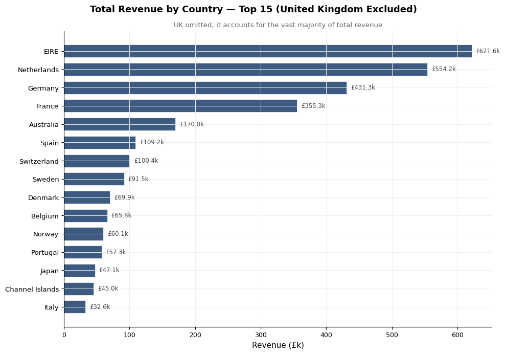
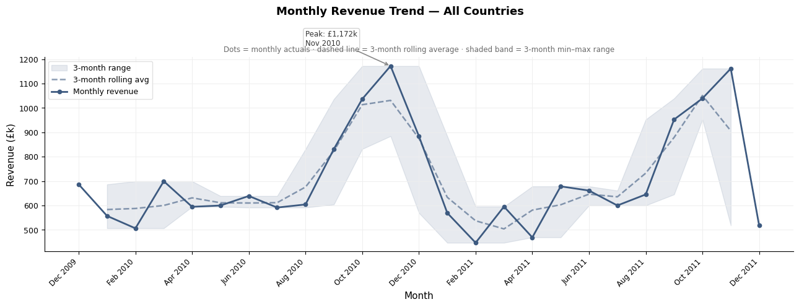
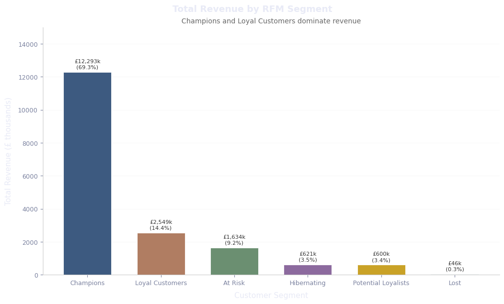
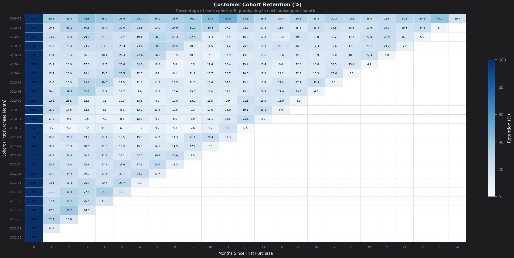
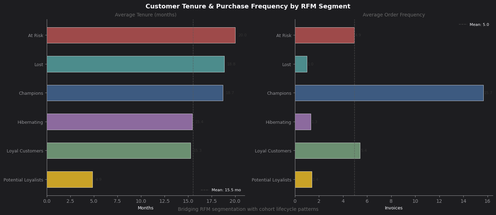

# Retail Revenue Concentration: RFM Segmentation Meets Cohort Retention

## Overview
End-to-end customer analytics pipeline on the Online Retail II dataset, covering data ingestion, cleaning, revenue analytics, RFM segmentation, cohort retention, and a cross-analysis connecting customer segments to purchase behavior over time.

## Dataset
- **Source:** [Online Retail II, UCI ML Repository](https://archive.ics.uci.edu/dataset/502/online+retail+ii)
- **Size:** 1,067,371 transactions (Dec 2009 – Dec 2011), 805,620 after cleaning
- **Fields:** Invoice, StockCode, Description, Quantity, InvoiceDate, UnitPrice, Customer ID, Country

## Workflow
The pipeline runs as a single script (`customer_segmentation_analysis.py`), structured in six sections:
1. **Data Loading** — UCI API with a direct HTTP download fallback
2. **Data Cleaning** — type fixes, removing cancellations and missing Customer IDs
3. **Revenue Analytics** — summary stats, revenue by country, monthly trend
4. **RFM Segmentation** — Recency / Frequency / Monetary scoring into 6 segments
5. **Cohort Retention Analysis** — monthly retention heatmap by first-purchase cohort
6. **RFM × Cohort Cross-Analysis** — tenure and order frequency by segment

## Key Findings
- **Total Revenue:** £17,743,429 across 36,975 invoices (Dec 2009 – Dec 2011)
- **UK dominance:** £14.7M (83% of revenue); top international market is the Netherlands
- **Champions segment:** 25% of customers drive 69% of revenue
- **Pareto effect:** top revenue quintile accounts for 77.3% of total revenue
- **Cohort retention:** steep drop to ~21% by Month 1, then a stable floor of 15–22%
- **Seasonal pulse:** a retention bump around Month 11–12, consistent with repeat holiday purchasing
- **At Risk insight:** longest average tenure (20.0 months) of any segment, but only 4.9 orders — a strong win-back candidate
- **Frequency vs. tenure:** Champions and At Risk have nearly identical tenure (18.7 vs. 20.0 months); order frequency (15.7 vs. 4.9) is the real differentiator — this is a habit-formation gap, not a new-customer problem

## Tech Stack
- Python — pandas, numpy, matplotlib, seaborn, openpyxl, requests
- Built on [Zerve](https://www.zerve.ai) — canvas-based, reproducible notebook environment

## Repository Structure
```
├── customer_segmentation_analysis.py   # full pipeline, single script
├── outputs/figures/                    # generated charts
├── requirements.txt
└── README.md
```

## Key Visuals






## How to Run
```bash
pip install -r requirements.txt
python customer_segmentation_analysis.py
```

## Author
Suman Kumar Oraon
